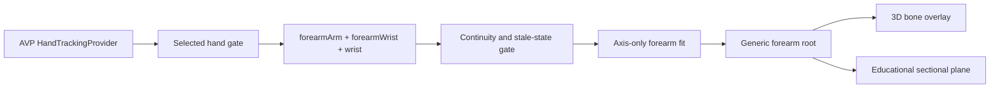

# UL-SELF-ARM-001 — AVP Self-Forearm Overlay POC

**Date:** 2026-08-08

**Status:** Active owner-approved pivot; implementation not yet started

**Mode:** Research spike followed by one vertical slice

**Purpose:** Prove that Apple Vision Pro can place the existing generic forearm model and educational sectional plane on the wearer's own forearm before attempting iPhone-to-AVP participant tracking.

## Decision

The next proof of concept is **AVP-only**. It uses visionOS `HandTrackingProvider` observations from the wearer, beginning with:

- `forearmArm`, which Apple describes as the anchor at the elbow end of the forearm;
- `forearmWrist`; and
- `wrist`.

The first result is an axis-only wearer-forearm registration. It does not require the iPhone app, local-network discovery, OpenCV, another participant, camera calibration, or a cross-device transform.

The iPhone scanner is preserved as a later external-participant provider. It is deferred, not discarded.

## Why the approach changed

- `[DEVICE]` The latest corrected iPhone run reported an upright 1280 x 720 preview in both landscape directions, 6/6 upper-limb joints, stable tracking, and an enabled Freeze control. This evidence remains in the development task and is not yet a committed evidence artifact.
- `[BLOCKED]` The repository still has no completed metric-depth authority, iPhone-camera-to-AVP-world calibration, scanner joint-frame sender, or live AVP consumer.
- `[SOURCE]` Standard visionOS hand tracking supplies the wearer's hand skeleton, including wrist and forearm anchors, directly in the AVP tracking space.
- `[SOURCE]` Direct main-camera frames on Vision Pro require an approved enterprise entitlement and license, so that is not the default POC path.

The previous plan combined too many independent risks: phone capture, pose inference, depth, networking, clock alignment, cross-device calibration, AVP consumption, model registration, and sectional rendering. The new vertical slice tests only the last three using native wearer-hand data.

## Brainstormed paths

Twelve candidate moves were considered:

1. Visualize every native AVP hand joint as spheres.
2. Highlight only wrist and the two forearm anchors.
3. Draw a live wrist-to-elbow-end axis.
4. Fit a translucent generic forearm model to that axis.
5. Move the existing educational axial plane along the fitted axis.
6. Drive the existing index-finger rig from native hand joints.
7. Use a manual elbow point with a native wrist point.
8. Use one printed elbow marker with native wrist/forearm tracking.
9. Continue the iPhone scanner as an isolated capture experiment.
10. Send uncalibrated iPhone 2D points directly to AVP.
11. Apply for enterprise AVP main-camera access and run body pose locally.
12. Build the full iPhone depth, calibration, transport, and AVP-consumer path now.

### Prioritization

| Priority | Candidates | Decision |
|---|---|---|
| Do first | 2, 3, 4, 5 | Smallest complete self-forearm learning experience |
| Preserve | 1, 6 | Existing capability-probe and finger-motion foundations |
| Fallback | 7, 8 | Use only if native forearm continuity or roll is inadequate |
| Defer | 9, 11, 12 | Valuable later, but each adds a separate dependency chain |
| Reject | 10 | Transport without metric calibration would create a convincing but spatially false overlay |

## Scope

### In scope

- One physical Apple Vision Pro and the wearer's left or right forearm.
- Native `HandTrackingProvider` only.
- A dedicated self-forearm route extending the existing joint capability probe.
- Explicit visualization of `forearmArm`, `forearmWrist`, and `wrist` tracking state.
- A measured axis between the elbow-end forearm anchor and wrist-end anchor.
- Axis-only translation, direction, and length for the existing generic forearm model.
- The existing `ReferenceSectionRoot` parented to the same fitted forearm root.
- A selectable normalized elbow-to-wrist sectional level.
- LIVE, PARTIAL, STALE, FAILED, and AXIS ONLY states.
- Physical continuity and visual-alignment evidence.

### Out of scope

- Shoulder tracking or a full upper-arm fit.
- Another person's arm or body.
- iPhone capture, OpenCV, network transport, or cross-device calibration.
- AVP main-camera access.
- Patient-specific CT/MRI, diagnostic accuracy, procedural guidance, or hidden-bone localization claims.
- A full 3D similarity claim from only two forearm points.

## Product truth boundary

`forearmArm` is an Apple tracking anchor near the elbow end of the forearm, not a validated internal elbow joint centre. The mesh and NLM reference sections come from different anatomical sources than the wearer. The overlay must remain labelled:

`CROSS-SUBJECT - APPROXIMATE - EDUCATIONAL - AXIS ONLY`

Two tracked points establish an axis and length. They do not prove forearm roll or a complete anatomical frame. If joint orientation is later used to estimate roll, that becomes a separate measured experiment and must not silently upgrade the state to full registration.

## Architecture

The iPhone-to-AVP architecture is intentionally absent from this milestone.

## Milestones

### Milestone 0 — Prove the native forearm signal

- Extend the current joint probe report so `forearmArm`, `forearmWrist`, and `wrist` are named and measured separately.
- Render these three anchors with distinct shapes or labels rather than relying only on the all-joint sphere cloud.
- Run two 30-second physical tests for each selected side through neutral, pronated, supinated, and gentle elbow-flexion poses.
- Record update count, per-anchor continuity, reacquisition, and visible left/right correctness without storing transforms or camera imagery.

Gate: at least one side has all three anchors in at least 90% of samples in two controlled runs, with no stale marker remaining visibly live.

Kill criterion: if `forearmArm` is unavailable or fails the continuity gate twice, stop native-only fitting and use the one-marker/manual-elbow fallback.

### Milestone 1 — Axis-only self-forearm fit

- Select exactly one wearer hand.
- Compute the elbow-end-to-wrist-end vector, midpoint, and length from live world transforms.
- Map the existing reviewed model elbow-to-wrist axis to that vector.
- Keep the fit explicitly `AXIS ONLY`; do not infer a full frame from two positions.
- Hide or fade the model when the selected anchors become partial or stale.

Gate: the model follows the correct wearer forearm in neutral and slow motion, and tracking loss is visible within the defined stale window.

### Milestone 2 — Sectional learning slice

- Reuse the existing forearm anatomy root and `ReferenceSectionRoot`; do not compute a second transform.
- Allow the wearer to move the educational section from elbow to wrist with an explicit UI control and accessibility alternative.
- Keep source, laterality, normalized level, and educational disclosure visible.
- Confirm that model and section remain together during motion and reacquisition.

Gate: a user can open the route, select a side, see the model, move the section, lose/recover tracking, and return to the library without the iPhone app.

### Milestone 3 — Physical acceptance

- Repeat left and right side trials where supported.
- Inspect neutral, pronation, supination, extension, gentle flexion, temporary occlusion, and reacquisition.
- Record continuity, apparent drift, visible roll error, latency, comfort, and whether the section remains understandable.
- Marcel provides the human go/no-go decision for demonstration value and truthfulness.

Gate: two repeatable demonstrations satisfy the success criteria below, or the route is reshaped to the marker/manual fallback.

### Milestone 4 — Decide whether to resume iPhone integration

Only after the AVP self-forearm slice passes, choose one next direction:

1. Improve self-forearm roll with measured native joint orientation.
2. Add one elbow marker while keeping native wrist/hand tracking.
3. Resume the iPhone external-participant path with metric depth, calibration, transport, and AVP consumption as one separately gated project.
4. Apply for enterprise AVP main-camera access for a future in-house research build.

## What “iPhone talks to AVP” means later

A future cross-device version requires two running apps:

1. The iPhone app captures a participant and produces timestamped metric camera-space observations.
2. The iPhone sends typed observations over the existing local peer channel.
3. A measured calibration converts iPhone-camera metres into AVP-world metres.
4. The AVP app validates session, calibration, clock, sequence, units, and staleness before moving the overlay.

The local network connection transports data; it does not spatially align the two devices. The measured cross-device transform is the missing authority and remains deferred.

## Success criteria

The self-forearm POC is successful when:

- it runs on a physical AVP without the iPhone companion;
- the selected side's three native wrist/forearm anchors pass the continuity gate;
- a generic forearm model visibly follows the correct wearer forearm;
- the app reports `AXIS ONLY` and hides/fades on partial, stale, or failed tracking;
- the existing sectional plane stays attached to the same registered root and can move from elbow to wrist;
- the experience remains understandable during slow controlled motion;
- no patient-specific, diagnostic, or full-frame claim is made; and
- Marcel accepts the experience as a useful educational technical demonstration.

## Ownership and next action

- **Lead agent:** specification, bounded implementation plan, shared files, validation, Git, and handoff.
- **Specialist, if used:** read-only review or one exclusively assigned new check; no concurrent writer on tracking or immersive-view files.
- **Marcel:** physical AVP permissions, movement protocol, comfort review, visual truth review, and go/no-go.

**First physical action:** open the existing `Test AVP joint detection` route and verify that the wearer can see stable anchors at the wrist and elbow end of the forearm. Record two 30-second runs before fitting the anatomy model.

## Authoritative platform sources

- [Apple: Tracking and visualizing hand movement](https://developer.apple.com/documentation/visionos/tracking-and-visualizing-hand-movement)
- [Apple: HandTrackingProvider](https://developer.apple.com/documentation/arkit/handtrackingprovider)
- [Apple: RealityKit hand-joint anchors](https://developer.apple.com/documentation/realitykit/anchoringcomponent/target-swift.enum/handlocation/handjoint)
- [Apple: Accessing the main camera](https://developer.apple.com/documentation/visionos/accessing-the-main-camera)
