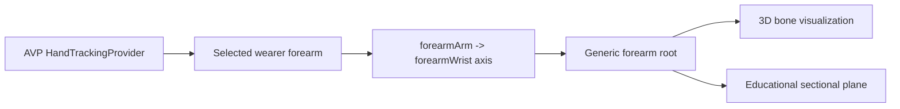
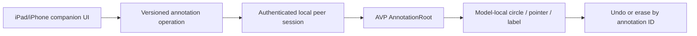
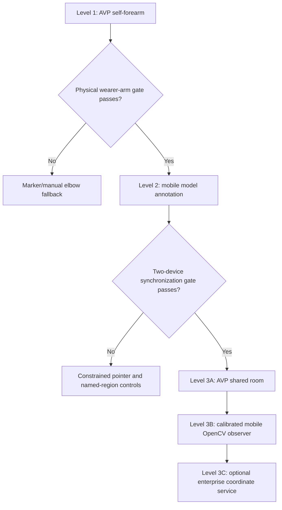

# Three-Level Shared Upper-Limb Product Roadmap

**Date:** 2026-08-08

**Status:** Owner-defined product direction; Level 1 active, Levels 2-3 gated

**Purpose:** Progress from a single-user wearer-arm proof of concept to mobile-assisted educational annotation and finally to a co-located multi-AVP shared anatomy experience.

## Product vision

Create an educational mixed-reality experience in which:

1. a Vision Pro wearer can visualize generic 3D bone and sectional anatomy over their own forearm;
2. a facilitator can use an iPhone or iPad to control and annotate that wearer's synchronized anatomy view; and
3. multiple Vision Pro wearers in the same room can share a common spatial experience and see permitted upper-limb overlays associated with one another.

Each level must pass its physical and truth gates before the next level begins. No level may claim patient-specific anatomy, fracture detection, diagnostic accuracy, or procedural guidance.

## Capability fan considered

The product direction was pressure-tested across these candidate capabilities:

1. Native wearer wrist/forearm anchor visualization.
2. Axis-only generic forearm fitting.
3. Elbow-to-wrist sectional plane control.
4. Native index-finger articulation.
5. iPad/iPhone control of model appearance and section level.
6. Touch-created circle, pointer, text, and erase operations on the synchronized model.
7. Annotation history, undo, author, and session ownership.
8. Literal mirroring and drawing over AVP passthrough video.
9. Nearby SharePlay between co-located Vision Pro headsets.
10. Shared world anchors or a physical room calibration board.
11. Mobile OpenCV detection of participants, limbs, and calibration markers.
12. A custom enterprise shared-coordinate service for controlled deployments.

The selected roadmap adopts 1-7 and 9-11 in gated order. Passthrough-video annotation is deferred because it adds protected camera access, video privacy, screen-to-world ray conversion, and occlusion problems before the model-annotation workflow has been proven. The enterprise shared-coordinate route remains a later alternative to nearby SharePlay or physical reference calibration.

## Level 1 — Personal AVP arm/bone POC

### User outcome

A person installs and launches the visionOS app, selects the left or right forearm, and sees a generic translucent forearm/bone representation plus an educational sectional plane follow their own tracked forearm.

### Architecture

### In scope

- Physical Apple Vision Pro.
- Wearer's own `forearmArm`, `forearmWrist`, `wrist`, hand, and finger observations.
- Selected left/right side.
- Axis-only generic anatomy overlay.
- Section-level slider from elbow end to wrist end.
- LIVE, PARTIAL, STALE, FAILED, and AXIS ONLY states.
- Explicit cross-subject educational disclosure.
- A build another approved test user can install and run under the current development-distribution arrangement.

### Gate to Level 2

- Two 30-second physical runs pass the three-signal continuity criterion for at least one side.
- The correct forearm is selected and the overlay does not remain falsely live after loss.
- Model and sectional plane remain on one root during slow controlled motion.
- A test user can complete launch, permission, side selection, tracking, sectional movement, loss/recovery, and exit without developer intervention beyond installation.
- Marcel accepts visual usefulness, comfort, and the truth wording.

### Weakest assumption and fallback

The weakest assumption is the physical stability and apparent usefulness of the `forearmArm` endpoint. If it fails two controlled runs, use one printed or human-confirmed elbow point with native wrist/hand tracking. Do not compensate by silently inventing shoulder or elbow anatomy.

## Level 2 — Mobile companion control and annotation

### User outcome

A facilitator uses an iPad or iPhone to view the same generic anatomy state, adjust the wearer experience, circle or point to an educational area, add a short label, undo, and erase. The annotation appears on the AVP model and remains attached while the wearer moves.

The first annotation target is the **shared digital anatomy model**, not raw AVP passthrough pixels. A mark such as a possible fracture area must be presented as `USER-MARKED EDUCATIONAL AREA`, not as detected or confirmed pathology.

### Architecture

### Required contract

Every operation records:

- schema and session version;
- annotation ID and author/device ID;
- selected anatomy asset and laterality;
- coordinate space, initially `anatomyModelLocal`;
- circle/stroke/point/text payload;
- create/update/delete action;
- sequence and timestamp; and
- educational provenance and display state.

Annotations are children of an `AnnotationRoot` under the same registered anatomy root as the model and sectional plane. They are never stored as untyped screen pixels or AVP-world coordinates without a named transform.

### Gate to Level 3

- One iPad/iPhone and one AVP pair reliably and identify the correct session.
- Circle, pointer, short label, undo, and erase synchronize bidirectionally.
- The annotation stays on the intended model location during forearm motion and sectional-level changes.
- Disconnect/reconnect does not duplicate operations or resurrect erased marks.
- The AVP wearer can hide all annotations and revoke companion control.
- A complete two-device physical demonstration passes without transmitting camera pixels or participant imagery.

### Weakest assumption and fallback

The weakest assumption is accurate touch selection on a 3D model shown on a 2D mobile display. Begin with named bones, section level, and constrained model-surface points. If freehand surface projection is unreliable, retain pointer/circle presets rather than pretending the touch maps precisely to hidden anatomy.

### Deferred Level 2B

Drawing directly over a streamed AVP wearer view is a separate research feature. It would require an approved camera/screen-sharing path, privacy controls, synchronized camera parameters, screen-ray-to-world conversion, depth/occlusion handling, and explicit recording policy. It is not required for Level 2 acceptance.

## Level 3 — Co-located multi-AVP shared anatomy

### User outcome

Two or more people wearing Vision Pro in the same room join one session. Each headset can publish its own permitted wearer-forearm tracking state, receive other participants' state, and render synchronized educational annotations and overlays in a shared room coordinate system. An iPhone or iPad can remain the facilitator and, after calibration, can use OpenCV to observe participants or physical markers.

### Architectural correction

OpenCV supplies image detections. It does **not** by itself supply a shared metric 3D world. Level 3 therefore needs four separate authorities:

1. **Detection:** native AVP hand/forearm tracking and optional mobile OpenCV observations.
2. **Metric device pose:** ARKit/device tracking, depth, camera intrinsics, or measured fiducials.
3. **Shared room coordinates:** nearby SharePlay plus shared world anchors, a common physical calibration board, or an approved `SharedCoordinateSpaceProvider` deployment.
4. **Identity and transport:** participant/session IDs, laterality, clock alignment, sequence, staleness, authorization, and encrypted networking.

### Recommended Level 3 sequence

#### Level 3A — AVP-to-AVP shared room

- Start a nearby SharePlay activity between two co-located AVPs.
- Establish a shared world anchor or common room reference.
- Each AVP tracks only its own selected forearm and publishes a typed pose relative to the shared space.
- Each AVP renders the other permitted participant's generic overlay and shared annotations.
- Test join, leave, identity, occlusion, stale state, and late reconnection.

#### Level 3B — Add the calibrated mobile observer

- Place a printed calibration board or marker cluster that defines a measured room coordinate frame.
- Calibrate the iPhone/iPad camera to that frame using camera intrinsics plus ARKit or a measured OpenCV marker pose.
- Run OpenCV participant/upper-limb detection only after the camera-to-room transform is valid.
- Associate each mobile observation with a consented participant ID and compare it against the participant's self-published AVP forearm state.
- Reject ambiguous identity, unknown units, wrong calibration, stale frames, and unmeasured model-relative depth.

#### Level 3C — Optional enterprise coordinate service

For a controlled in-house deployment, evaluate Apple's `SharedCoordinateSpaceProvider`. It aligns multiple participants by exchanging ARKit `CoordinateSpaceData` over the chosen local network transport, but access outside FaceTime requires the Shared Coordinate Space entitlement.

### Level 3 acceptance gate

- Two physical AVPs join one shared session and agree on one room anchor.
- Participant identity and left/right side remain correct through movement and reconnection.
- Each headset hides stale or unauthorized peer overlays.
- Shared annotations appear on the same model/room location for both wearers within an agreed visible tolerance.
- The mobile observer's camera-to-room transform is measured and versioned before any OpenCV observation is rendered.
- A second person, failed calibration, duplicate participant, delayed packet, and peer departure are all rejected or shown truthfully.
- No person is observed, identified, recorded, or shared without explicit consent and an approved privacy workflow.

### Weakest assumption and fallback

The weakest assumption is reliable common-space and participant-identity authority across all devices. If nearby shared anchors or enterprise access are unavailable, use the measured physical calibration board and keep the experience to a supervised POC. If identity remains ambiguous, render no person-specific overlay.

## Dependency ladder

## Development rules

- Keep only one level active at a time.
- Preserve the existing iPhone/OpenCV scanner as reusable Level 3 research evidence; do not wire it into Level 1 or Level 2.
- Freeze a versioned coordinate/annotation contract before adding UI writers.
- A mobile connection transports commands; it does not automatically create spatial alignment.
- A visual landmark is not a verified internal anatomical point.
- A user circle is an annotation, not a fracture diagnosis.
- Generic anatomy, reference sectional images, wearer anatomy, and mobile observations remain separately labelled sources.
- Physical-device evidence is mandatory for tracking, alignment, comfort, multi-user identity, and stale-state behavior.

## Current status

- **Level 1:** active. The AVP-only build has passed automated validation, strict-concurrency builds, signing, installation, and launch. The physical wearer continuity and visual acceptance gate is pending.
- **Level 2:** planned only. Existing companion transport and synchronized overlay controls are reusable foundations; annotation operations are not implemented.
- **Level 3:** research roadmap only. The iPhone OpenCV scanner checkpoint is preserved, but shared-room calibration, multi-AVP participant state, mobile-to-room transformation, and identity authority are not implemented.

## Immediate next action

Complete the Level 1 physical AVP run:

1. Open `Test AVP joint detection`.
2. Select one side and start tracking.
3. Confirm three forearm points and `AXIS ONLY - LIVE`.
4. Move the section control.
5. Run the 30-second neutral/pronation/supination/gentle-flexion sequence.
6. Briefly occlude and confirm stale fade, hiding, and reacquisition.
7. Record the three per-anchor continuity values and Marcel's visual go/no-go.

Do not begin Level 2 implementation until this gate is reviewed.

## Authoritative Apple sources

- [Connecting iPadOS and visionOS apps over the local network](https://developer.apple.com/documentation/visionos/connecting-ipados-and-visionos-apps-over-the-local-network)
- [Tracking and visualizing hand movement](https://developer.apple.com/documentation/visionos/tracking-and-visualizing-hand-movement)
- [ImageTrackingProvider](https://developer.apple.com/documentation/arkit/imagetrackingprovider)
- [Share visionOS experiences with nearby people](https://developer.apple.com/videos/play/wwdc2025/318/)
- [SharedCoordinateSpaceProvider](https://developer.apple.com/documentation/arkit/sharedcoordinatespaceprovider)
- [Shared Coordinate Space entitlement](https://developer.apple.com/documentation/bundleresources/entitlements/com.apple.developer.arkit.shared-coordinate-space.allow)
