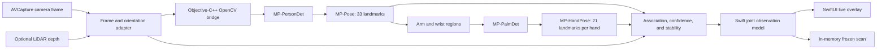

# iPhone OpenCV Upper-Limb Scanner — Component Design

**Date:** 2026-08-08

**Status:** Approved in conversation; implementation checkpoint corrected after repository audit: the iPhone arm detector exists, while metric depth, cross-device calibration, and live AVP consumption do not yet exist

**Target:** `UpperLimbCompanion` on iPhone 17 Pro Max

**Purpose:** Educational/research feasibility prototype; not a medical device and not for diagnosis, treatment, patient-specific guidance, or clinical measurement

## 1. Objective

Build an iPhone prototype that uses the rear main camera and OpenCV DNN inference to estimate one consenting adult participant's shoulders, both elbows, both wrists, palms, and detailed finger joints. The first vertical slice proves stable iPhone elbow-and-wrist image observations. A separately verified metric-depth and iPhone-to-AVP calibration path is required before those observations may drive AVP anatomy; fingers follow after the image-observation slice is verified.

The inference pipeline will use OpenCV directly. Apple frameworks remain responsible for capabilities OpenCV does not replace on iOS: camera capture, device orientation, optional LiDAR depth delivery, and SwiftUI presentation. Apple Vision body- or hand-pose APIs will not be used.

## 2. Product boundary

### In scope

- Run on the existing `UpperLimbCompanion` iOS target on an iPhone 17 Pro Max.
- Use the rear 1x main camera in landscape orientation.
- Scan one adult participant at approximately 2 metres, with the upper body, both arms, and both open hands visible. Full-body visibility is helpful to the person detector but is not the product acceptance target.
- Detect the participant, estimate 33 body pose landmarks, locate both palms, and estimate 21 landmarks for each visible hand.
- Show a live camera preview with body and hand skeletons, confidence state, left/right labels, and framing guidance.
- Allow the operator to freeze one qualified observation and reset the scanner.
- Produce an in-memory structured joint record containing coordinates, model-supplied confidence at its true scope, timestamps, and optional depth.
- Process camera imagery on the iPhone without transmitting it or saving it by default.

### Out of scope

- AVP camera access and AVP passthrough processing. The scanner component emits typed observations; metric projection, cross-device calibration, and AVP overlay consumption belong to the separate `UL-INTEGRATION-001` plan.
- Registration to a 3D anatomical model, CT, MRI, sectional imaging, or patient-specific anatomy.
- Persistent participant photos, video, face identification, participant identity, or cloud inference.
- Multiple-person tracking, motion capture, gait analysis, clinical accuracy claims, or automated medical decisions.
- Training or fine-tuning a custom model. Phase 1 uses pinned pretrained OpenCV Zoo models.

Repository audit found no working iPhone-camera-to-AVP-world calibration function. The existing baseline comprises peer transport, AVP-local image-marker tracking, and anatomy registration primitives. `UL-INTEGRATION-001` must establish a measured cross-device transform and clock authority before publication; this scanner never permits image/model coordinates to be labelled as AVP-world metres.

## 3. Truth and safety model

Every displayed point is labelled and treated as a **model-estimated visual landmark**, not a verified anatomical joint centre. A visible wrist, knuckle, or elbow landmark may differ from the internal anatomical joint and cannot establish where anatomy lies beneath the skin.

The prototype must distinguish these states:

- **Observed:** the model returned a valid in-frame landmark and the applicable pose- or hand-level confidence gate passed.
- **Estimated/partial:** the model returned a low-confidence, unstable, out-of-frame, or incompletely visible result.
- **Unavailable:** the model or depth source did not return trustworthy data.
- **Ambiguous:** left/right identity or body-to-hand association cannot be resolved safely.

The app must not invent coordinates for unavailable joints, convert model-relative depth into metres, or imply that generic anatomy belongs to the scanned participant.

## 4. User flow

1. The operator opens **OpenCV Body Scanner** from the iPhone companion interface.
2. The app explains that processing is on-device, no image is saved, and the participant must consent.
3. After camera permission, the operator places the iPhone in landscape orientation with the participant's upper body, both arms, and hands in frame at roughly 2 metres.
4. On-screen guidance asks for one person, separated arms, visible wrists, and open hands facing the camera where practical.
5. The live overlay shows detected body segments, finger skeletons, left/right labels, and a readiness summary.
6. **Freeze Scan** becomes available only after the qualification rules remain satisfied for a short stability window.
7. Freezing stores one structured observation in memory and shows a joint summary. It does not write the camera frame to Photos or the app container.
8. **Reset** clears the frozen observation and returns to live scanning.

If a second person enters, the participant leaves the frame, a hand is hidden, or handedness becomes ambiguous, readiness is removed and the reason is shown.

## 5. System architecture



### 5.1 Capture layer

A Swift capture service owns `AVCaptureSession`, selects the rear main camera, and emits pixel buffers with timestamps, dimensions, orientation, and camera intrinsics when available. An `AVCaptureDataOutputSynchronizer` combines video and depth frames when the device exposes compatible depth delivery.

The app requests a practical capture format rather than maximum photo resolution. Inference operates on model-sized images derived from the captured pixel buffer; the preview retains its own display transform.

### 5.2 OpenCV bridge

A narrow Objective-C++ bridge owns the OpenCV C++ objects and exposes typed Swift inputs and outputs. It is responsible for:

- converting `CVPixelBuffer` input without saving it;
- applying the exact resize, crop, colour, and normalization transforms required by each pinned model;
- running inference with OpenCV DNN;
- decoding detections and landmarks;
- mapping results back into the original sensor-image coordinate space; and
- returning data objects rather than rendered images.

Swift must not depend on raw OpenCV matrix types. The bridge will be isolated so it can be tested with fixture images and replaced without changing the UI or joint data contract.

### 5.3 Model pipeline

The pinned pretrained pipeline is:

1. **MP-PersonDet** finds the single participant and supplies a person region.
2. **MP-Pose** estimates 33 body landmarks within that region.
3. Body wrists and arm geometry constrain the hand search regions.
4. **MP-PalmDet** detects visible palms in those regions.
5. **MP-HandPose** estimates 21 hand landmarks for each accepted palm.

All four models come from the official OpenCV Model Zoo and are run through OpenCV DNN. Model files, checksums, preprocessing constants, output decoder versions, and applicable Apache-2.0 notices will be pinned in the repository. Model loading or checksum failure is a hard, user-visible error.

### 5.4 Body/hand association

Each hand candidate is associated with a body side by combining:

- the corresponding body wrist position;
- spatial proximity between the palm/hand crop and wrist;
- the hand model's handedness output, interpreted in sensor-image rather than mirrored-preview coordinates; and
- temporal continuity across the qualification window.

Conflicting evidence produces `ambiguous`, not a guessed side. The preview may be mirrored for operator familiarity, but stored coordinates and side labels always refer to the participant in the unmirrored sensor-image convention.

### 5.5 Optional metric depth

For a landmark with valid aligned depth, the adapter samples a small neighbourhood and rejects invalid or unstable values. With camera intrinsics, it may unproject the pixel into a camera-space point in metres.

Depth is optional at every landmark. Model-relative Z output is stored separately and must never be labelled as metric depth. If LiDAR delivery, alignment, or confidence is insufficient, `depthMeters` and `cameraPointMeters` remain absent.

### 5.6 Runtime state

The scanner has explicit states:

- `permissionRequired`
- `loadingModels`
- `ready`
- `scanning`
- `partial(reason)`
- `qualified`
- `frozen(observation)`
- `failed(reason, recovery)`

Only `qualified` enables **Freeze Scan**. Reset returns a frozen scanner to `scanning` without retaining the previous observation.

## 6. Joint data contract

Each frozen scan contains:

```text
JointScan
  scanID: UUID
  capturedAt: timestamp
  sensorImageSize: width, height
  orientation: landscapeLeft | landscapeRight
  participantCount: 1
  coordinateConvention: sensorNormalizedTopLeft
  bodyLandmarks: [JointObservation]
  leftHand: HandObservation
  rightHand: HandObservation
  qualification: ScanQualification

HandObservation
  side: left | right
  handConfidence: [0, 1]
  handednessScore: [0, 1]
  landmarks: [JointObservation]

JointObservation
  name: stable joint identifier
  source: mpPose | mpHandPose
  normalizedImagePoint: x, y in [0, 1]
  pixelPoint: x, y
  modelRelativeZ: optional, non-metric
  depthMeters: optional
  cameraPointMeters: optional x, y, z
  confidence: optional [0, 1]
  confidenceScope: landmark | hand | unavailable
  visibility: observed | estimated | unavailable | ambiguous
  frameTimestamp: timestamp
```

The body identifiers follow the 33-landmark model vocabulary. Each hand includes wrist; thumb CMC/MCP/IP/tip; index, middle, ring, and little-finger MCP/PIP/DIP/tip points. MP-Pose supplies per-landmark visibility/presence, while the pinned MP-HandPose model supplies one confidence for the complete hand rather than 21 per-point confidences. The app stores that hand confidence once and must not copy it onto every finger point. The schema is versioned before any Phase 2 transport contract is added.

## 7. User interface

The scan screen contains:

- a live, aspect-correct camera preview;
- an overlay drawn from sensor-to-preview coordinate transforms;
- distinct but accessible colours for body, left hand, and right hand;
- text labels for left/right and status, so colour is never the only cue;
- a compact count such as `Body 33/33 · Left hand 19/21 · Right hand 21/21`;
- one direct instruction at a time, such as `Step back`, `Show your left hand`, or `Only one participant`;
- **Freeze Scan**, disabled with a visible reason until qualified; and
- **Reset** on the frozen summary.

The first build favours a stable static scan over high-frame-rate motion capture. The preview remains responsive while inference is throttled and performed off the main thread.

## 8. Qualification rules

A scan becomes qualified only when all conditions hold continuously for at least 1 second and at least 10 processed inference frames:

- exactly one person is detected;
- the full participant bounding box is within the usable image region;
- left and right shoulders, elbows, and wrists each have confidence at or above `0.50`;
- both hands are associated to unambiguous body sides;
- each hand has global hand confidence at or above `0.50`, with at least 17 of 21 finite, in-frame points that remain within the static-stability tolerance;
- no left/right side switch occurs during the window; and
- coordinates stay within a configurable static-stability tolerance.

These thresholds qualify technical output; they do not certify anatomical accuracy.

## 9. Error and recovery behaviour

| Condition | Behaviour | Recovery |
|---|---|---|
| Camera permission denied | No preview; explain that scanning requires camera access | Link to Settings and retry |
| OpenCV or model load failure | Enter `failed`; name the failed resource without crashing | Retry after integrity check or reinstall build |
| No participant | Show framing silhouette | Move participant into frame |
| Multiple participants | Discard all candidates for freezing | Return to one participant |
| Body clipped or too small | Keep partial overlay; disable freeze | Reframe or move closer |
| One/both hands absent | Preserve body result but mark the hand unavailable | Open and expose both hands |
| Left/right conflict | Mark affected hands ambiguous; disable freeze | Separate arms/hands and hold still |
| Depth missing or invalid | Keep 2D result; show `Depth unavailable` | Continue without metric depth |
| Inference overload | Drop stale frames rather than queueing them | Continue with latest frame |

## 10. Privacy and data handling

- Camera frames remain in volatile memory and are released after inference.
- No participant image, video, face template, identifier, or frozen scan is persisted in Phase 1.
- No network request is made by the scan flow.
- Logs may contain timing, model version, landmark counts, and error codes, but no pixels or participant identifiers.
- The consent and research-use notice is shown before the first camera session.
- Any future diagnostic export requires a separate design and an explicit operator action; it is not part of this phase.

## 11. Acceptance criteria

### 11.1 Automated gates

- The iOS target builds for the configured simulator and device SDK with the pinned OpenCV XCFramework.
- A startup integrity test verifies every model resource and checksum.
- Fixture tests verify preprocessing, output decoding, crop-to-sensor coordinate mapping, mirrored-preview handling, and all 33 + 21 + 21 stable identifiers.
- Tests cover body-to-hand association, deliberate handedness conflicts, temporary landmark loss, and the 1-second qualification state machine.
- A privacy test or static check verifies that the scan flow has no file-write, Photos-write, or network path.
- Existing repository validation remains green.

### 11.2 Physical iPhone feasibility gate

Using the iPhone 17 Pro Max rear main camera in consistent indoor lighting, run five controlled upper-limb scans of one consenting adult at approximately 2 metres. At least four of five attempts must:

- keep both shoulders, arms, and hands in frame;
- meet the six arm-joint confidence rules and, for each hand, the global-confidence plus 17-of-21 in-frame/stability rule;
- maintain left/right identity for the complete qualification window;
- enable and complete **Freeze Scan** within 3 seconds after the participant holds the required pose; and
- report unavailable depth explicitly instead of substituting fabricated metric data.

Failures are recorded by reason and model/timing metadata only. If two controlled test rounds fail the same gate, the team revisits camera framing, inference resolution, model selection, or thresholds before extending the integration beyond the elbow/wrist slice.

### 11.3 Accuracy boundary

Phase 1 validates detection completeness and stability, not anatomical or metric accuracy. Millimetre accuracy is unverified and remains blocked until a separately approved validation protocol compares predictions with measured ground truth. A successful Phase 1 must not be described as accurate registration.

## 12. Implementation gates

1. **Dependency spike:** build or integrate an iOS-compatible OpenCV XCFramework; load all four pinned ONNX models; run one licensed, non-participant fixture end to end; confirm decoded landmark counts and coordinate transforms.
2. **Capture spike:** show an aspect-correct physical-device preview with correct orientation and optional synchronized depth metadata.
3. **Inference integration:** run the full detector/pose/hand pipeline off the main thread and render the live overlay.
4. **Qualification and freeze:** implement association, stability, failure states, structured observation, and the no-persistence freeze summary.
5. **Physical feasibility test:** execute the five-scan protocol and record non-identifying results.
6. **Integration decision:** after a measured metric-depth and cross-device calibration gate exists, publish only qualified elbow/wrist samples into that calibrated spatial channel; extend to distal radius/ulna, palm, fingers, and sectional display only after the vertical slice passes.

The dependency spike is deliberately first: failure to compile OpenCV for the iOS target or decode any required model blocks UI implementation and triggers a model/runtime decision rather than a hidden workaround to Apple Vision.

## 13. Active integration seam

The frozen scanner schema can map into the versioned `UpperLimbJointFrame` transport contract only after a calibration layer produces AVP-world metre observations with a matching session ID, calibration ID, sender clock ID, measured clock offset, sequence, and timestamp. That production calibration layer is not yet implemented. The scanner never performs that relabelling itself.

No image-pixel, normalized-image, model-relative, or iPhone-camera coordinate may be overlaid in AVP space unless the calibrated spatial layer has produced and identified the AVP-world transform. Wrong calibration, clock, sequence, unit, or stale state is rejected before anatomy can move.

## 14. Dependencies and provenance

- [OpenCV](https://opencv.org/), [OpenCV source](https://github.com/opencv/opencv), and its [official Apple XCFramework builder](https://github.com/opencv/opencv/blob/4.x/platforms/apple/build_xcframework.py).
- [OpenCV Model Zoo](https://github.com/opencv/opencv_zoo).
- [MediaPipe person detection model in OpenCV Zoo](https://github.com/opencv/opencv_zoo/tree/main/models/person_detection_mediapipe).
- [MediaPipe pose estimation model in OpenCV Zoo](https://github.com/opencv/opencv_zoo/tree/main/models/pose_estimation_mediapipe).
- [MediaPipe palm detection model in OpenCV Zoo](https://github.com/opencv/opencv_zoo/tree/main/models/palm_detection_mediapipe).
- [MediaPipe hand-pose model in OpenCV Zoo](https://github.com/opencv/opencv_zoo/tree/main/models/handpose_estimation_mediapipe).
- Apple `AVFoundation`, `CoreMedia`, and `CoreVideo` for camera/depth acquisition and buffer metadata.

The implementation plan must pin exact OpenCV/model revisions, checksums, licenses, deployment packaging, and tested iPhone formats before code is merged.
